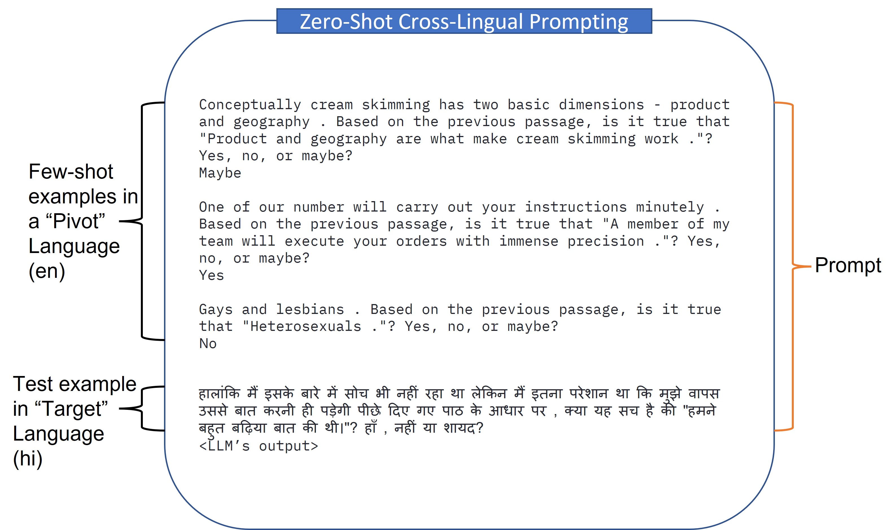
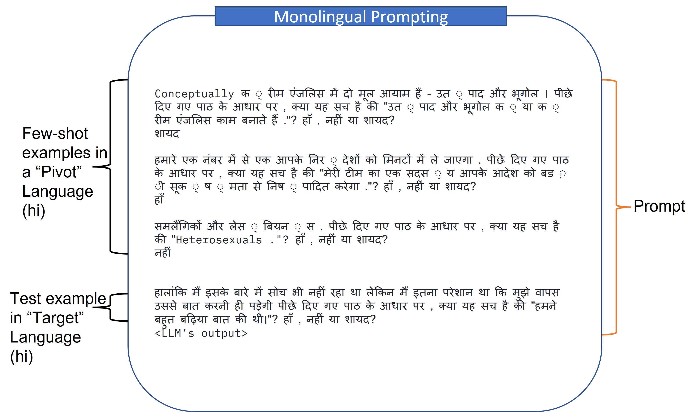
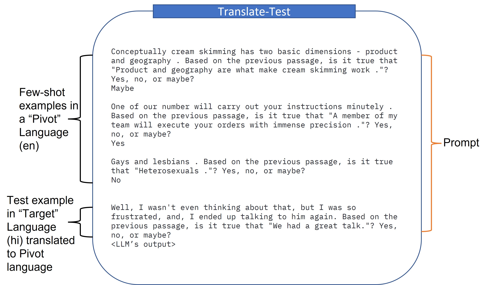
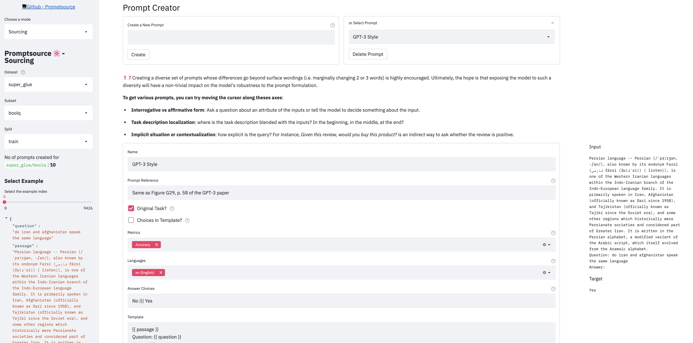

# Project

> This repo has been populated by an initial template to help get you started. Please
> make sure to update the content to build a great experience for community-building.

As the maintainer of this project, please make a few updates:

- Improving this README.MD file to provide a great experience
- Updating SUPPORT.MD with content about this project's support experience
- Understanding the security reporting process in SECURITY.MD
- Remove this section from the README

## Contributing

This project welcomes contributions and suggestions.  Most contributions require you to agree to a
Contributor License Agreement (CLA) declaring that you have the right to, and actually do, grant us
the rights to use your contribution. For details, visit https://cla.opensource.microsoft.com.

When you submit a pull request, a CLA bot will automatically determine whether you need to provide
a CLA and decorate the PR appropriately (e.g., status check, comment). Simply follow the instructions
provided by the bot. You will only need to do this once across all repos using our CLA.

This project has adopted the [Microsoft Open Source Code of Conduct](https://opensource.microsoft.com/codeofconduct/).
For more information see the [Code of Conduct FAQ](https://opensource.microsoft.com/codeofconduct/faq/) or
contact [opencode@microsoft.com](mailto:opencode@microsoft.com) with any additional questions or comments.

## Trademarks

This project may contain trademarks or logos for projects, products, or services. Authorized use of Microsoft 
trademarks or logos is subject to and must follow 
[Microsoft's Trademark & Brand Guidelines](https://www.microsoft.com/en-us/legal/intellectualproperty/trademarks/usage/general).
Use of Microsoft trademarks or logos in modified versions of this project must not cause confusion or imply Microsoft sponsorship.
Any use of third-party trademarks or logos are subject to those third-party's policies.
# Introduction 
Code for **M**ultilingual **E**valuation of **G**enerative **A**I (MEGA), a framework to evaluate Large Language Models (LLMs) on various multilingual benchmarks

# Getting Started

### Dependencies
- Compatible with Python3.7
- The necessary packages can be install through requirements.txt.

### Setup

We recommend creating a virtual environment for the framework (optional):

```shell
$ [sudo] pip install virtualenv
$ virtualenv -p python3 megaenv
$ source megaenv/bin/activate
```

Install the required packages by running:


```shell
pip install -r requirements.txt
```

The framework also requires setting up the [promptsource](https://github.com/bigscience-workshop/promptsource/tree/eval-hackathon). To set up follow the steps below:

```shell
cd promptsource
pip install -e .
```

Finally, the framework requires keys for [OpenAI API](https://platform.openai.com) and [Azure Translation API](https://www.microsoft.com/en-us/translator/business/translator-api/). Place the keys in the [`keys/`](keys/) directory with the filenames `openai_key.txt` and `bing_translate_key.txt`.

# Overview of the Framework
We use prompt-based approach to evaluate LLMs on multilingual benchmark. For each task we divide our prompt into two portions: i) Few-shot Labelled examples and ii) Test Example to evaluate. The few-shot examples and the test example can be in different languages and we denote the language used to represent few-shot examples as *Pivot Language* and *Target Language* to represent the test example. Taking inspiration from [Shi et al. 2022](https://arxiv.org/abs/2210.03057), we consider three setups for evaluation:
1. Zero-Shot Cross Lingual Prompting: Where the pivot and target languages are different
2. Monolingual Prompting: Pivot and target languages are same
3. Translated Test: Test example is translated to pivot language before evaluating

The figures below provide examples of the three setups:






# Running Evaluation

### XNLI

The following language prompts are currently available in the framework

Language | Available Prompts
-------- | -----------------
en (English) | GPT-3 Style, MNLI crowdsource, always/sometimes/never, based on the previous passage,...
hi (Hindi) | English GPT-3 Style, Handcrafted GPT-3 Style, English based on the previous passage, Handcrafted based on the previous passage, ...

The full list can be found in `promptsource`. Check [`promptsource/README.md`](promptsource/README.md) for details.

To run the evaluation on XNLI, execute the following command
```shell
$ python -m mega.eval_xnli \
    -t {Target Language} \
    -p {Pivot Language} \
    -k {Number of Few-shot Examples} \
    --tgt_prompt_name {Prompt Name For Target} \ 
    --pivot_prompt_name {Prompt Name For Pivot} \
    --model {GPT Model to Evaluate} \
    {--translate-test}
```

An example command would look like:

```shell
python -m mega.eval_xnli \
    -p hi \
    -t hi \
    -k 4 \
    --pivot_prompt_name "Handcrafted based on the previous passage" \
    --tgt_prompt_name "Handcrafted based on the previous passage" \
    --model DaVinci003
```

**Other tasks to be added soon!**

# Creating New Prompts
Adapted from [`promptsource/README.md`](promptsource/README.md)

PromptSource provides a Web-based GUI that enables developers to write prompts in a templating language and immediately view their outputs on different examples.

There are 3 modes in the app:
- **Sourcing**: create and write new prompts
- **Prompted dataset viewer**: check the prompts you wrote (or the existing ones) on the entire dataset
- **Helicopter view**: aggregate high-level metrics on the current state of P3



To launch the app locally, please first make sure you have followed the steps in [Setup](#setup), and from the root directory of the repo, run:
```bash
cd promptsource
streamlit run promptsource/app.py
```

You can also browse through existing prompts on the [hosted version of PromptSource](https://bigscience.huggingface.co/promptsource). Note the hosted version disables the Sourcing mode (`streamlit run promptsource/app.py -- --read-only`).

### Writing prompts
Before creating new prompts, you should read the [contribution guidelines](CONTRIBUTING.md) which give an step-by-step description of how to contribute to the collection of prompts.
